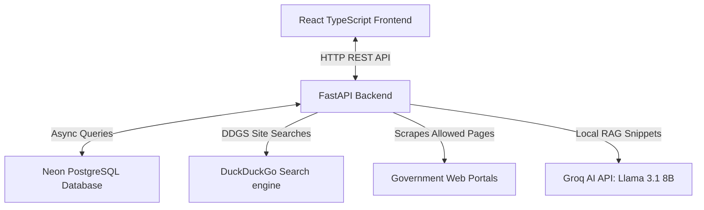
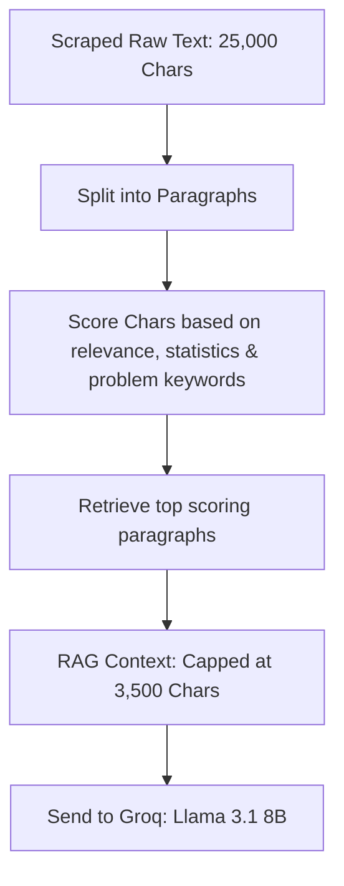

# Government Problem Finder: How It Works & RAG Architecture

This document describes the end-to-end architecture, scraping workflow, and the **Local Retrieval-Augmented Generation (RAG)** pipeline implemented to optimize performance and prevent API token exhaustion.

---

## 1. System Architecture Overview

The application is structured into three main layers:

* **Frontend**: Built with React, TypeScript, Tailwind CSS, and Framer Motion. Pages like **Discover** and **Live Search** interact with the backend APIs via Axios.
* **Backend**: Powered by FastAPI, SQLAlchemy (async), and Python 3.12. It orchestrates scraping, local snippet matching, and AI extraction.
* **Database**: Hosted on Neon PostgreSQL. Stores problem models with structured details (title, description, category, affected population, severity, state, original report source URL, and year).

---

## 2. Dynamic Search & Scraping Pipeline

When you type a query (e.g., *"Ministry of Education school teacher vacancy"*):

1. **Database Check First**: The backend runs an `ILIKE` database query against stored problems. If enough results exist, they are returned instantly to avoid scraping again.
2. **Search Engine Scoping**: If the database does not have enough records, a search is triggered:
   * It appends `site:gov.in` to the query to ensure only official portals are returned.
   * It fetches the **top 15 search results**.
3. **Concurrent Page Scraping**: The scraper concurrently crawls the URLs using `httpx` and `BeautifulSoup`.
   * **Security/Compliance Handling**: Disables forced certificate bypasses (`verify=True`) and simply discards any portals that block requests or have invalid SSL configurations.
   * **Skipping Fails**: Failed pages are skipped, and the remaining successfully crawled pages are kept.

---

## 3. Local RAG (Retrieval-Augmented Generation)

Sending entire crawled pages (which often contain 20,000+ characters of boilerplate code, navbars, sidebars, and policies) directly to LLMs leads to **429 Rate Limit (Too Many Requests)** errors and high API latency.

To solve this, a **Local RAG Pipeline** is implemented directly in `ai_service.py` to filter noise before sending data to Groq.

### How the Local RAG Retriever Works

1. **Paragraph Chunking**: The raw content of all crawled pages is split into paragraphs (separated by newlines) and cleaned.
2. **Scoring Engine**: Each paragraph receives a score based on three criteria:
   * **Query Match** (+5 points per word): Checks if the paragraph contains words from the search query.
   * **Problem Indicators** (+3 points per indicator): Checks for words like `shortage`, `vacancy`, `lack`, `deficit`, `poverty`, `crisis`, `poor`, `severe`, `unemployment`.
   * **Statistics & Data** (+4 points): Uses regular expressions to match numbers, percentages, or units like `crore`, `lakh`, `million`, `%` (crucial for government data verification).
3. **Retrieval Selection**: Paragraphs are sorted in descending order of score. The retriever selects only the top paragraphs until it reaches a maximum budget of **3,500 characters** (~900 tokens).
4. **Token Savings**: This reduces the input volume sent to Groq by **85% to 90%**!
5. **Prompt Injection**: The AI only processes highly relevant snippets (with original page URLs appended), guaranteeing high-quality extractions without consuming excessive token limits.

### Model Optimization
The system uses the **`llama-3.1-8b-instant`** model. This model is exceptionally fast for structured JSON extraction tasks and has significantly higher rate limit thresholds on Groq compared to 70B models.

---

## 4. Database & Dynamic Report Mapping

Once the AI extracts structured problems (as a JSON array):
* Each problem is checked for duplicates using `difflib.SequenceMatcher` (>85% title similarity).
* New, unique problems are saved to PostgreSQL.
* When loading the **Reports** page, the backend counts how many problems in the database have a `source` URL containing the domains of the 8 main whitelisted agencies (e.g. `niti.gov.in`, `education.gov.in`). These counts are served dynamically in real-time.
